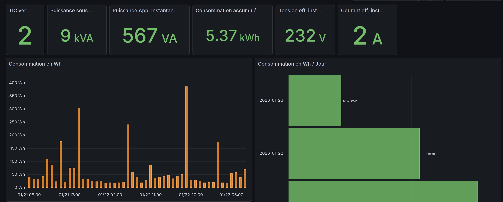

# Linky TIC exporter

Prometheus Linky TIC exporter
- Basé sur la librairie https://github.com/dmachard/go-ticreader
- Testé avec https://github.com/hallard/uTeleinfo



## Métriques exposées

Disponible via /metrics sur le port 9100 

Mode standard:

- linky_tic_standard_vtic - Version de la TIC
- linky_tic_standard_sinsts - Puissance app. Instantanée soutirée en VA
- linky_tic_standard_east - Energie active soutirée totale en Wh
- linky_tic_standard_pref - Puissance app. de référence en kVA
- linky_tic_standard_irms1 - Courant efficace, phase 1 en A
- linky_tic_standard_urms1 - Tension efficace, phase 1 en A

Mode historique:

- linky_tic_historique_base (gauge) - Index option Base en Wh
- linky_tic_historique_iinst (gauge) - Intensité Instantanée en A
- linky_tic_historique_papp (gauge) - Puissance apparente en VA

## Docker run

Execution de l'image docker

```bash
sudo docker run -d --env-file ./env.list --device /dev/ttyACM0:/dev/ttyACM0 -p 9100:9100 --name=linky_exporter linkytic-exporter:latest
```

## Variables d'environnement

| Variables | Description |
| ------------- | ------------- |
| LINKY_DEBUG | true ou false |
| LINKY_TIC_DEVICE | addresse du port USB à utiliser, par défaut /dev/ttyACM0 |
| LINKY_TIC_MODE | mode d'exécution HISTORICAL ou STANDARD |

## Docker build

Contruction de l'image docker

```
sudo docker build . --file Dockerfile -t linkytic-exporter
```

## Docker compose

```yaml
services:
  linkytic_exporter:
    image: dmachard/linkytic-exporter:v1.2.0
    ports:
      - "9100:9100/tcp"
    devices:
      - "/dev/ttyACM0:/dev/ttyACM0"
    environment:
      - LINKY_TIC_DEVICE=/dev/ttyACM0
      - LINKY_TIC_MODE=HISTORICAL
    restart: unless-stopped
```